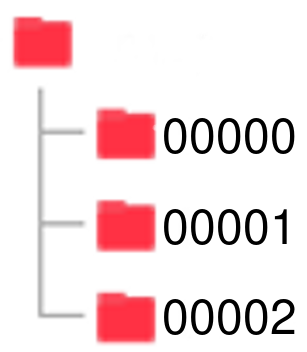

 # Example Train CNN
В данном примере показано как обучить свою нейронную сеть на Keras и python

## Запуск программы

Сначала необходимо скачать репозиторий, а также установить зависимости для python программ.
```bash
git clone https://github.com/Artemy2807/cflow.git
cd cflow-master/github/example/train/
pip install -r requirements.txt
```
В папке [img/to-learn](../../img/to-learn) есть архив images-to-learn.zip, его необходимо разархивировать. В этом файле находятся фотографии для обучения нейронной сети. Запускаем программу для обучения CNN. Программа принимает следующие параметры:
- --dataset - папка с папками фотографий для обучения CNN, папка куда вы разархивировали файл images-to-learn.zip
- --model - имя файла с обученной моделью, появляется после завершения программы. Расширение должно быть .pb
```bash
python train.py --dataset ../../img/to-learn/images --model model.pb
```

После завершения программы в папке появится файл model.pb. Это файл нейронной сети. В примере load_model показано как использовать файл модели.

## [train.py](train.py)

### Параметры обучения нейронной сети


- IMG_SIZE - размер входного изображения в пикселях. Нейронная сеть принимает квадратные изображения, поэтому указываем только одну сторону.
- INIT_LR - коэффициент скорости обучения нейронной сети. Если коэффициент большой, то нейронная сеть обучается быстрее. Рекомендуемый коэффициент 0.01
- EPOCHS - Количество эпох для обучения нейронной сети. Эпоха - это количество раз, которое обучающие данные пройдут через нейронную сеть.
- BATCH_SIZE - количество партий для обучения нейронной сети. Партия - это количество раз, которое нейронная сеть обработает данные перед обновлением своих весов.
```python
IMG_SIZE = 48
INIT_LR = 0.01
EPOCHS = 20
BATCH_SIZE = 16
```

### Архитектура нейронной сети

Инициализируем архитектуру нейронной сети, в функции cnn_model(). Чтобы создать свою архитектуру, используйте функции:
- Conv2D - 2D свёртка
- MaxPooling2D - слой субдискретизации
- Dropout - слой выпадания нейроннов
- Flatten - сглаживание вывода
- Dense - полносвязный слой
```python
def cnn_model():
    model = Sequential()
    model.add(Conv2D(32, (3, 3), padding='same', input_shape=(IMG_SIZE, IMG_SIZE, 3), activation='relu'))
    model.add(Conv2D(32, (3, 3), activation='relu'))
    model.add(MaxPooling2D(pool_size=(2, 2)))
    model.add(Dropout(0.2))
    model.add(Conv2D(64, (3, 3), padding='same', activation='relu'))
    model.add(Conv2D(64, (3, 3), activation='relu'))
    model.add(MaxPooling2D(pool_size=(2, 2)))
    model.add(Dropout(0.2))
    model.add(Conv2D(128, (3, 3), padding='same', activation='relu'))
    model.add(Conv2D(128, (3, 3), activation='relu'))
    model.add(MaxPooling2D(pool_size=(2, 2)))
    model.add(Dropout(0.2))
    model.add(Flatten())
    model.add(Dense(512, activation='relu'))
    model.add(Dropout(0.5))
    model.add(Dense(len(classes), activation='softmax'))
    return model
```

## Как добавить новый класс для обучения нейронной сети

### Подготовка фотографий

Чтобы обучить нейронную сеть, необходимо правильно подготовить фотографии. В удобном вам месте создайте папку, далее в этой папке создаём столько количество папок сколько у вас классов изображений. В каждой такой папке должны находиться фотографии своего класса. Также папки с фотографиями должны быть правильно названы. Первая папка с классом должна называться 00000, далее в других названиях папок увеличиваем последнюю цифру на 1. Максимальное количество классов 10, то есть название последней папки будет 00009. Ниже показан пример иерархии папок.



### Изменение кода 

Допустим мы добавили новый класс изображений, тогда в файле [train.py](train.py) нужно изменить следующую строку:
```python
classes = ['00000', '00001', '00002'] 
```
на
```python
classes = ['00000', '00001', '00002', '00003']
```
Далее запустите файл [train.py](train.py) как показано в заголовке "Запуск программы". Если всё было сделано правильно, то вы получите новую модель нейронной сети.
